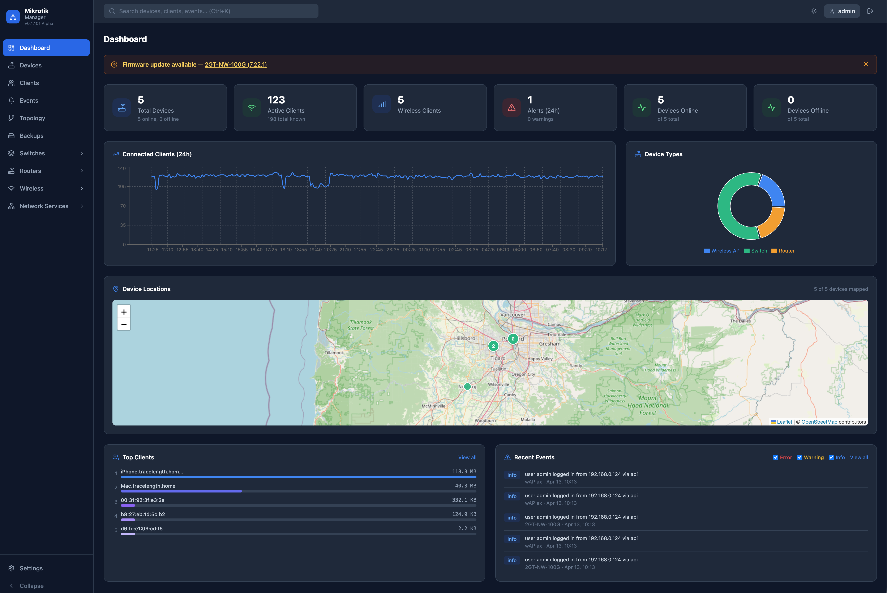
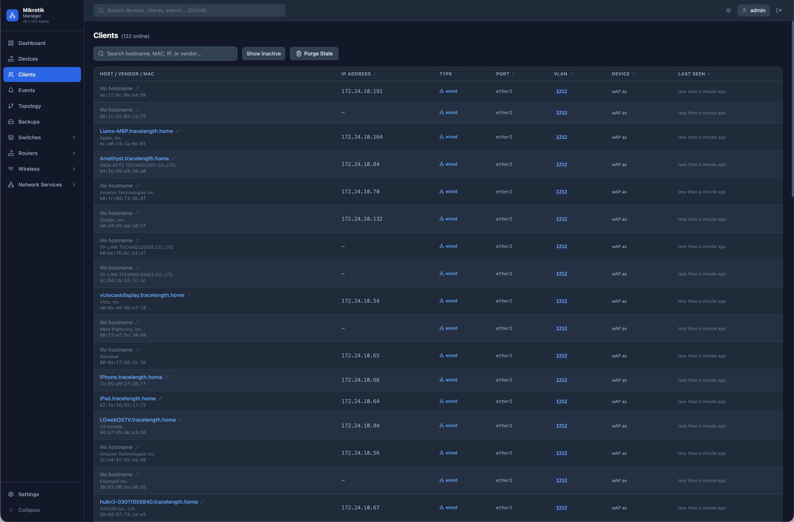
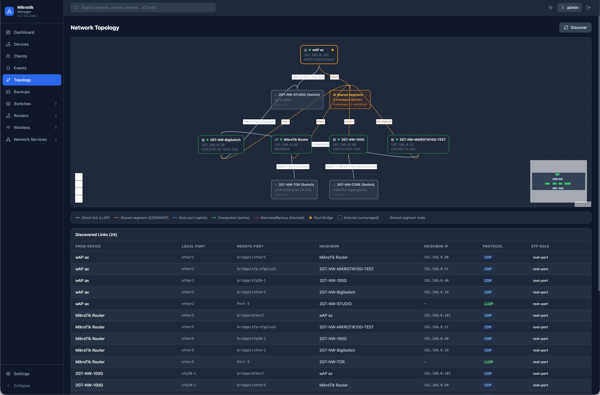
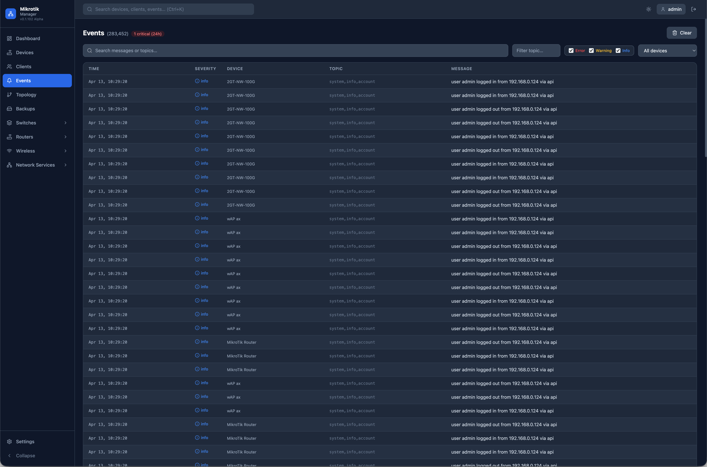
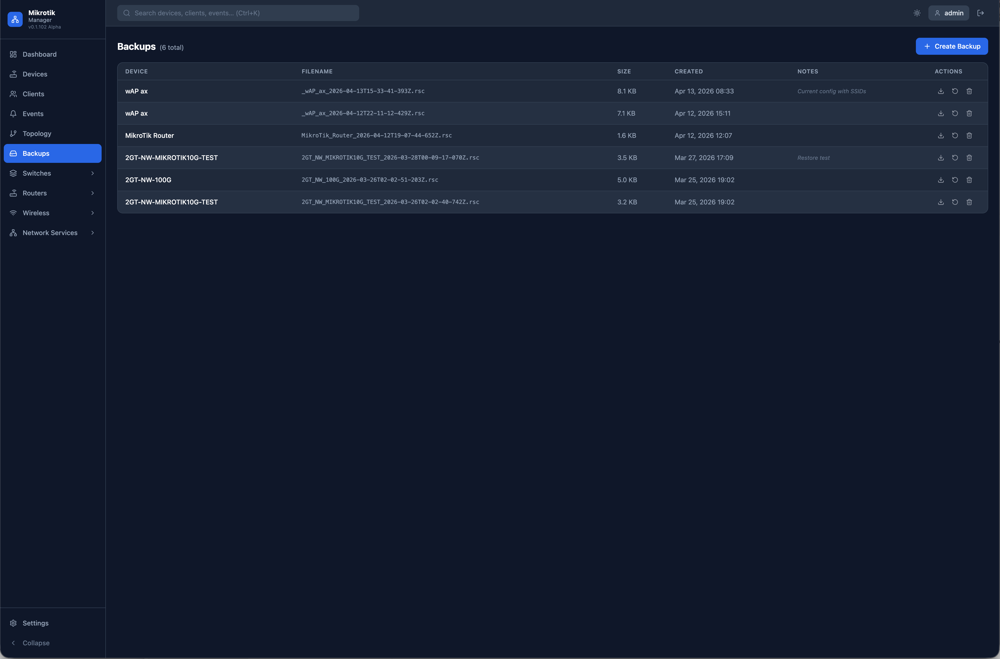

# MikroTik Manager

A self-hosted, full-stack network management platform for MikroTik devices. Monitor, configure, and manage your entire MikroTik infrastructure — routers, switches, and wireless access points — from a single web interface.


---

## Screenshots

<p align="center">
  
</p>

<br>

### Dashboard

<p align="center">
  
</p>

### Device Management

<table>
  <tr>
    <td align="center">
      <br>
      <sub><b>Device List</b></sub>
    </td>
    <td align="center">
      <br>
      <sub><b>Device Overview</b></sub>
    </td>
  </tr>
  <tr>
    <td align="center">
      <br>
      <sub><b>Switch Ports &amp; Throughput</b></sub>
    </td>
    <td align="center">
      <br>
      <sub><b>Hardware Monitor</b></sub>
    </td>
  </tr>
</table>

### Wireless

<p align="center">
  
</p>

### Client Tracking

<table>
  <tr>
    <td align="center">
      <br>
      <sub><b>Client List</b></sub>
    </td>
    <td align="center">
      <br>
      <sub><b>Client Detail View</b></sub>
    </td>
  </tr>
</table>

### Network Topology

<p align="center">
  
</p>

### Events &amp; Backups

<table>
  <tr>
    <td align="center">
      <br>
      <sub><b>Event Log</b></sub>
    </td>
    <td align="center">
      <br>
      <sub><b>Backup Management</b></sub>
    </td>
  </tr>
</table>

---

## Features

### Dashboard
- Live KPI cards: total devices, online/offline count, connected wireless clients, active alerts, fleet-wide 30-day availability %
- Device type distribution chart
- Firmware update notifications with per-device details
- Historical client count graph (1h → 30d range)

### Device Management
- Add, edit, and delete MikroTik devices (routers, switches, wireless APs)
- Automatic polling: status, model, firmware version, RouterOS version
- Firmware update availability detection
- Per-device notes, rack location, and physical address with map support
- Device credential encryption at rest
- **Bulk device add** — "Try All" discovered devices runs as a server-side background job (survives browser tab close) with live progress and cancel support
- CPU load and historical sparkline displayed correctly for all device types, including hardware switches that report 0% CPU via ASIC offloading
- **Device tags** — colored labels for organizing and filtering devices; full tag management in Settings
- **30-day availability tracking** — per-device uptime %, outage count, and longest outage duration recorded automatically; visible on the device Overview tab and the fleet dashboard

### Routers
- Routing table viewer
- Interface overview with IP assignments
- Firewall rule inspection
- Router-specific settings and configuration

### Switches
- VLAN management (create, edit, delete VLANs)
- Per-port configuration and VLAN membership
- Switch overview with port status
- **Copy VLANs from another switch** — 3-step wizard that copies VLAN IDs and names from any other managed switch onto the current device, with manual per-VLAN port assignment (tagged/untagged) using a click-to-cycle interface chip grid, conflict detection with per-VLAN skip/overwrite control, and a review summary before any changes are applied

### Wireless
- Per-AP SSID management — create, edit, enable/disable, delete wireless interfaces
- **Bulk SSID deployment** — push an SSID configuration to all managed APs simultaneously
- Security profile management (WPA2/WPA3, PSK, EAP)
- Hardware radio information and band filtering (RouterOS 7 wifi package + legacy wlan package)
- Scheduled and on-demand **spectral scans** per radio
- Scheduled and on-demand **AP scans** (nearby access point discovery)
- Real-time radio monitoring
- Wireless client tracking with vendor lookup

### Network Services
Each service supports multi-device management with conflict detection:

| Service | Capabilities |
|---|---|
| **DHCP** | IPv4 & IPv6 servers, address pools, static leases, live lease table |
| **DNS** | Upstream servers, static records (A/AAAA/CNAME/MX/NS/PTR/TXT/SRV), cache flush, DoH |
| **NTP** | Server (broadcast/manycast), client (unicast/multicast), sync status |
| **WireGuard** | Interface management, peer configuration, public key display, RX/TX stats |
| **Syslog** | Logging actions (remote/memory/disk/echo) and routing rules; single-device or push-to-all with per-entry coverage; enable/disable rules |
| **NetFlow** | One-toggle Traffic Flow (NetFlow v9/IPFIX) export per device, pointed at the built-in collector; live export status per device |

### Traffic Analytics (NetFlow)
- **Built-in NetFlow/IPFIX collector** — receives Traffic Flow exports from your routers on UDP 2055 (no external tools needed); decoder supports both NetFlow v9 and IPFIX
- **Per-client usage accounting** — flows are attributed to known clients (IP → MAC) so every client shows real upload/download totals; "Data (today)" column on the Clients page and an App Traffic card on each client's detail page
- **Application breakdown** — flows are classified by protocol and port into readable categories (HTTPS, QUIC, DNS, SSH, Email, WireGuard, …) with fleet-wide and per-client views
- **Top talkers** — ranked client bandwidth usage over 1h/24h/7d/30d ranges on the dedicated Traffic page
- **Automatic deduplication** — a flow crossing two managed routers is exported twice; the collector keeps only the best exporter per client each window so totals are never double-counted
- **NAT-tolerant ingest** — when routers export from behind NAT or a VPN/Tailscale subnet router, packets arrive from an address that matches no managed device; the collector accepts these as per-source "unidentified" exporters (configurable) so flows are still attributed to clients instead of silently dropped, and the NetFlow page shows a banner naming the NAT'd source. Per-device export status/flow counters require un-NAT'd sources — exempt `udp/2055` from masquerade on the gateway to restore device identity (and exact cross-device dedup)
- **Fully UI-configurable** — enable the collector, set its address/port/version in the NetFlow page, then toggle export per device; the platform pushes `/ip traffic-flow` configuration to each router via the RouterOS API
- Configurable retention for detailed time-series (default 30 days) and daily rollups (default 365 days)

### Network Topology
- **LLDP-authoritative** — LLDP links are treated as ground truth; CDP/MNDP links to the same neighbor are automatically suppressed, eliminating spurious "Shared Segment" nodes
- Bidirectional LLDP pairs merged into a single canonical edge with both port names labeled
- Auto-discovered network map using LLDP, CDP, and MNDP neighbor data
- Interactive node graph with device type icons and protocol-priority link deduplication
- **Manual link drawing** — Connect Mode lets you drag between any two devices to draw a persistent connection for devices with no auto-discovered neighbors; connections are stored in the database and survive page reloads
- **Orphan node detection** — devices with no known connections are grouped in a dedicated row with an orange warning banner prompting Connect Mode usage
- Manual links render as purple dashed edges with a midpoint delete button

### Device Network Tools
Per-device diagnostic and testing tools accessible from the device detail Tools tab:

| Tool | Description |
|---|---|
| **Ping** | ICMP reachability test with RTT and loss metrics |
| **Traceroute** | Hop-by-hop path trace to any destination |
| **IP Scan** | ARP sweep of a subnet to discover live hosts |
| **Wake-on-LAN** | Send a magic packet from the MikroTik device to wake a host |
| **Packet Capture** | Start the RouterOS sniffer, capture for 5–60 seconds, download a `.pcap` file directly to your browser (opens in Wireshark). Requires SSH credentials on the device. |
| **Bandwidth Test** | Measure throughput between two devices. Select any managed device as the target — the bandwidth-test server is automatically enabled on the target before the test and disabled afterward. Manual IP mode available for non-managed targets. |

### Backups
- Trigger RouterOS backups on demand via SSH
- **Scheduled automatic backups** — pick a daily, weekly, or monthly schedule and time in Settings (no cron knowledge required); runs for all online devices
- Download and manage backup files from the UI

### Configuration History
- Per-device config snapshots based on the device's full RouterOS `/export` — config-only, so counters and operational state never create noise — captured automatically whenever the configuration changes (deduplicated by content hash, so a snapshot is only stored on a real change)
- **Config History** tab on each device with a timeline of snapshots and a one-line summary of what changed (e.g. `+8 / −3 lines`)
- Side-by-side **line diff** between any two snapshots, rendered as readable RouterOS commands
- **Capture snapshot** button for an on-demand checkpoint, with honest feedback when nothing has changed since the last one
- **One-click rollback** — each snapshot links a restorable `.rsc` backup, so rolling back reuses the proven restore path
- The snapshot and its backup are one artifact: snapshot backups are clearly badged **Config Snapshot** on the Backups page, and deleting one (from either place) removes the other so they never drift apart
- Fires a `config_drift` alert (off by default) when a device's configuration changes
- Snapshot cadence and retention configurable via `config_snapshot_interval_min` / `config_snapshot_retention`

### Alerts
Configurable alert rules with cooldown periods:
- Device online / offline
- High CPU or memory usage (configurable threshold)
- SSL certificate expiry warning
- Firmware update available
- RouterOS log errors and warnings
- New device discovered
- Configuration changed (drift detection)

Alert delivery channels: **Email**, **Slack**, **Discord**, **Telegram**

### Maintenance Windows
- Schedule planned downtime windows per device or group of devices to suppress alerts automatically
- One-time or recurring windows (cron-based)
- Active window management with activate/deactivate controls
- Managed from Settings → Maintenance

### Audit Log
- Every write operation (create, update, delete, push) performed by an authenticated user is recorded automatically
- Log includes: user, timestamp, HTTP method, API path, entity type/ID, summary, IP address, and HTTP response status
- Filterable and paginated view in Settings → Audit Log
- Useful for multi-operator environments to track who changed what and when

### Configuration Templates
- Define reusable configuration sets (DNS servers, NTP servers, syslog host) and push them to one or more managed devices in a single operation
- Per-device result reporting (success / error per device)
- Managed from Settings → Config Templates

### Global Search
Instant search across devices, clients, and events from the top navigation bar.

### User Management & Access Control
- Role-based access: **Admin**, **Operator** (read/write), **Viewer** (read-only)
- Admin-only user creation and role assignment
- JWT authentication with secure session handling
- **Two-factor authentication (TOTP)** — per-user 2FA setup via QR code (compatible with Google Authenticator, Authy, etc.); login requires a 6-digit code after password when enabled; disable with password confirmation
- **Credential preset access control** — presets can be restricted to admins only (`allow_operator_use`); operators only see presets they are permitted to use when adding or updating devices

### TLS / HTTPS
- Automatic self-signed certificate generation on first run
- Upload a custom certificate and private key via the Settings UI
- nginx handles TLS termination and HTTP→HTTPS redirect

---

## Tech Stack

| Layer | Technology |
|---|---|
| **Frontend** | React 18, TypeScript, Vite, Tailwind CSS |
| **State / Data** | TanStack Query v5, React Router v6, Zustand |
| **Charts** | Recharts |
| **Topology** | @xyflow/react |
| **Maps** | Leaflet |
| **Terminal** | xterm.js |
| **Backend** | Node.js, Express, TypeScript |
| **Primary DB** | PostgreSQL 15 |
| **Time-series DB** | InfluxDB 2.7 |
| **Cache / Queue** | Redis 7, BullMQ |
| **Real-time** | Socket.IO |
| **Device comms** | RouterOS API (port 8728), SSH2 |
| **Proxy** | nginx (TLS termination, static file serving) |
| **Container** | Docker Compose |

---

## Requirements

- [Docker](https://docs.docker.com/get-docker/) and [Docker Compose](https://docs.docker.com/compose/install/) (v2+)
- MikroTik devices running **RouterOS 6.x or 7.x** with the API service enabled
- Network access from the host running this application to your MikroTik devices on port **8728** (or your configured API port)

---

## Quick Deploy (Pre-built Images)

No source code or build toolchain required — just Docker and Docker Compose.

### 1. Download the compose file

```bash
curl -O https://raw.githubusercontent.com/2GT-Media-Group-LLC/mikrotik-manager/main/docker-compose.ghcr.yml
```

### 2. Create your environment file

```bash
curl -O https://raw.githubusercontent.com/2GT-Media-Group-LLC/mikrotik-manager/main/.env.example
mv .env.example .env
```

Edit `.env` and set at minimum:

```env
JWT_SECRET=your_long_random_jwt_secret_here
ENCRYPTION_KEY=your_32_character_encryption_key_
CORS_ORIGIN=https://your-domain.example.com
```

### 3. Start the application

```bash
docker compose -f docker-compose.ghcr.yml up -d
```

Docker pulls the pre-built images from GitHub Container Registry and starts the stack. No compilation, no cloning.

### 4. Open the app

Navigate to **https://localhost** (or your server's IP/hostname) and log in with `admin` / `admin`.

> To update to the latest release: `docker compose -f docker-compose.ghcr.yml pull && docker compose -f docker-compose.ghcr.yml up -d`

---

## Quick Start (Build from Source)

For contributors or anyone who wants to build the images locally.

### 1. Clone the repository

```bash
git clone https://github.com/2GT-Media-Group-LLC/mikrotik-manager.git
cd mikrotik-manager
```

### 2. Configure environment variables

Copy the example environment file and edit it:

```bash
cp .env.example .env
```

At minimum, change these values in `.env`:

```env
# Required — use long, random strings
JWT_SECRET=your_long_random_jwt_secret_here
ENCRYPTION_KEY=your_32_character_encryption_key_

# Required for production deployments (set to your domain)
# CORS_ORIGIN=https://manager.example.com

# Optional — defaults work for a local install
DB_PASSWORD=mikrotik_secure_pw
INFLUXDB_TOKEN=mytoken123456789
```

> **Security note:** Never commit your `.env` file to version control. The `.gitignore` already excludes it.

### 3. Start the application

```bash
docker compose up -d
```

The first run will:
- Build the frontend (React → static files)
- Build the backend (TypeScript → Node.js)
- Initialize PostgreSQL with the database schema
- Initialize InfluxDB
- Generate a self-signed TLS certificate

### 4. Open the app

Navigate to **https://localhost** (or your server's IP/hostname).

Accept the browser's self-signed certificate warning, or upload a real certificate in **Settings → TLS Certificate**.

### 5. Log in

Default credentials on first run:

| Username | Password | Role |
|---|---|---|
| `admin` | `admin` | Admin |

**Change the default password immediately** in Settings → Users.

---

## Enabling the RouterOS API

Typically, API access is enabled on MikroTik devices. However if you can't connect via API, ensure the API service is enabled:

```
/ip service enable api
```

For API over SSL (port 8729):
```
/ip service enable api-ssl
```

The default API port is `8728`. You can configure a different port per device in the MikroTik Manager interface.

---

## Configuration Reference

All configuration is done via environment variables in `.env`:

| Variable | Default | Description |
|---|---|---|
| `JWT_SECRET` | `changeme_use_a_long_random_secret_at_least_32_chars` | Secret for signing JWT tokens. **Change this.** |
| `ENCRYPTION_KEY` | `changeme32byteslongencryptionkey` | 32-character key for encrypting device passwords at rest. **Change this.** |
| `CORS_ORIGIN` | *(localhost defaults set by Docker Compose)* | Comma-separated list of browser origins allowed to call the API (e.g. `https://manager.example.com`). **Required in production** — set this to your domain. |
| `DB_PASSWORD` | `mikrotik_secure_pw` | PostgreSQL password |
| `INFLUXDB_TOKEN` | `mytoken123456789` | InfluxDB admin token |
| `INFLUXDB_ORG` | `mikrotik-manager` | InfluxDB organization name |
| `INFLUXDB_BUCKET` | `metrics` | InfluxDB bucket for time-series data |
| `INFLUXDB_ADMIN_PASSWORD` | `admin_password_123` | InfluxDB admin UI password |
| `HTTP_PORT` | `80` | Host port for HTTP (redirects to HTTPS) |
| `HTTPS_PORT` | `443` | Host port for HTTPS |

### Credential encryption (`ENCRYPTION_KEY`)

Device API and SSH passwords stored in PostgreSQL are encrypted at rest using **AES-256-GCM** (`backend/src/utils/crypto.ts`). The key material comes from the **`ENCRYPTION_KEY` environment variable** (see table above). If the value is exactly 32 bytes long it is used as-is; otherwise the implementation derives a 32-byte key with SHA-256 (still driven by that env var).

**If the key is lost:** ciphertext cannot be decrypted; you must re-enter credentials on each device (or restore a database backup that was encrypted with the old key).

**If the key is rotated (compromise or policy):** there is no automatic bulk re-encryption in the app today. Operational recovery is:

1. Set a new `ENCRYPTION_KEY` and restart the backend.
2. For each managed device, update API/SSH credentials via the UI (or API) so the server stores new ciphertext under the new key. Old rows still hold ciphertext from the previous key until updated.

For a planned rotation with many devices, restore from backup or script updates against the API using plaintext passwords from your vault.

---

## Updating

Pull the latest changes and rebuild:

```bash
git pull
docker compose up -d --build backend nginx
```

Database migrations run automatically on backend startup.

---

## Project Structure

```
mikrotik-manager/
├── frontend/               # React + TypeScript (Vite)
│   └── src/
│       ├── pages/          # Page components (one per route)
│       ├── components/     # Shared UI components
│       ├── services/       # API client (Axios)
│       ├── hooks/          # Custom React hooks
│       └── types/          # TypeScript type definitions
│
├── backend/                # Node.js + Express + TypeScript
│   └── src/
│       ├── routes/         # REST API route handlers
│       ├── services/       # Business logic (polling, alerts, backups)
│       │   └── mikrotik/   # RouterOS API client and device collector
│       ├── db/             # Database migrations
│       ├── config/         # DB, InfluxDB, Redis connections
│       ├── middleware/      # Auth, audit logging, error handling
│       └── utils/          # Helpers (crypto, OUI lookup, etc.)
│
├── nginx/                  # Reverse proxy config and Dockerfile
├── docker-compose.yml
└── .env.example
```

---

## Contributing

Contributions are welcome! Please open an issue before submitting a pull request so we can discuss the approach.

1. Fork the repository
2. Create a feature branch: `git checkout -b feature/your-feature`
3. Commit your changes: `git commit -m "Add your feature"`
4. Push to the branch: `git push origin feature/your-feature`
5. Open a pull request

---

## License

This project is licensed under the **GNU Affero General Public License v3.0 (AGPLv3)** — see the [LICENSE](LICENSE) file for the full text.

### What this means

- You are free to use, modify, and distribute this software.
- If you run a modified version of this software as a network service (e.g., as a hosted web app), you **must** make your modified source code available to users of that service under the same AGPLv3 license.
- Any distributed copies or derivatives must also carry the AGPLv3 license.

This license was chosen to ensure that improvements made to this project — including those deployed as a service — remain open and available to the community.

---

## AI Assistance

This project was designed and built with the help of [Claude](https://claude.ai) by Anthropic. AI assistance was used throughout development — including architecture decisions, backend services, frontend components, the CI/CD pipeline, security configuration, and unit tests.

We believe in being transparent about how software is made. The code has also been reviewed and tested using AI and is maintained by the project authors.

---

## Disclaimer

This project is not affiliated with or endorsed by MikroTik. MikroTik and RouterOS are trademarks of SIA MikroTīkls. Use this software at your own risk. Always test configuration changes in a non-production environment first.
